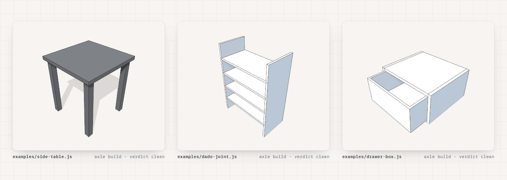

# Axle Keys — local CAD engine



Build parametric CAD models in JavaScript, run them on your own machine, and get the
**same verdict** [axlekeys.com](https://axlekeys.com) gives — offline, in about 55ms.

This is what a verdict looks like. Real output, captured by this repo's release check from
the example it ships:

```text
$ node packages/engine/cli.mjs build examples/side-table.js
✓ built in 354ms — 5 part(s)
  overall    450.0 ×   450.0 ×   500.0 mm

   Top                  450.0 ×   450.0 ×    25.0
   Leg 1                 40.0 ×    40.0 ×   475.0
   Leg 2                 40.0 ×    40.0 ×   475.0
   Leg 3                 40.0 ×    40.0 ×   475.0
   Leg 4                 40.0 ×    40.0 ×   475.0

  no problems.
```

Push a parameter past what the model declares and the same command says what went wrong —
with the shared volume **measured**, not inferred from bounding boxes:

```text
$ node packages/engine/cli.mjs build examples/drawer-box.js --param clearance=-1
✓ built in 502ms — 6 part(s)
  overall    400.0 ×   470.0 ×   200.0 mm

   Side L                18.0 ×   350.0 ×   200.0
   Side R                18.0 ×   350.0 ×   200.0
   Bottom               364.0 ×   350.0 ×    18.0
   Top                  364.0 ×   350.0 ×    18.0
   Back                 364.0 ×    18.0 ×   164.0
   Drawer               366.0 ×   332.0 ×   165.0

  3 problem(s):
   [error] part_interference: Parts 'Side L' and 'Drawer' occupy 34,980mm³ of the SAME solid volume (measured intersection, not a bounding-box guess; boxes penetrate 1.0×212.0×165.0mm). Parts must share faces, never volume — cut the pocket/dado out of one of them, or move the other.
   [error] part_interference: Parts 'Side R' and 'Drawer' occupy 34,980mm³ of the SAME solid volume (measured intersection, not a bounding-box guess; boxes penetrate 1.0×212.0×165.0mm). Parts must share faces, never volume — cut the pocket/dado out of one of them, or move the other.
   [error] part_interference: Parts 'Top' and 'Drawer' occupy 8,768mm³ of the SAME solid volume (measured intersection, not a bounding-box guess; boxes penetrate 364.0×212.0×1.0mm). Parts must share faces, never volume — cut the pocket/dado out of one of them, or move the other.
```

This is the real execution path, not a demo: `packages/engine/runner.mjs` is the file the
hosted geometry service imports, at the same paths, so a stack trace here matches a stack
trace there.

## Use

```bash
axle build   model.js                 # verdict: dimensions, per-part boxes, problems
axle build   model.js --json          # the same, machine-readable
axle explain model.js                 # what --param accepts: each parameter, value, range
axle sweep   model.js --range w=300:800:50 --require passed --score min:volume   # search the space
axle watch   model.js                 # rebuild on every save, ~55ms
axle repl                             # paths on stdin, one JSON verdict per line
axle export  model.js --step --stl    # real CAD files
axle build   model.js --param topSize=700
```

⏱ **Use `watch` or `repl` for real work.** A one-shot `axle build` spends ~900ms starting
Node and the OpenCascade kernel to do ~100ms of building. The persistent modes pay that once
and then rebuild in ~55ms — measured at **19.8× faster** than the one-shot on the same machine.

`explain` is the door into that: it prints every parameter with its declared range without
building, so an agent can sweep a model it has never opened. `explain --json` returns the
same `params` array `build --json` carries.

## Search a space

Stop drawing one design and ask the whole range. `axle sweep` builds every variant of a
parameter space **on one warm kernel** — the first build pays for OpenCascade, the rest cost
~55ms each — and ranks them by a **measured** field of the verdict, never an opinion:
`volume` (mm³), `overall.x|y|z`, `parts`, `problems`, `buildMs`, or a swept parameter's
own name. `--require passed` drops the variants whose verdict failed *before* ranking;
`--where overall.x<=800` constrains on the same terms. Real output, captured by this repo's
release check — the widest `slatPitch` the checks still accept, and the first one they refuse:

```text
$ node packages/engine/cli.mjs sweep examples/slat-bench.js --range slatPitch=70:170:10 --require passed --score max:slatPitch
slat-bench.js — 11 variant(s) swept in 881ms · 11 built · 9 passed · 2 excluded by --require passed · 9 ranked by max:slatPitch

   #  slatPitch  passed  problems  overall (mm)            volume (mm³)
   1        150  ✓              0  1410.0 × 400.0 × 450.0      16420000
   2        140  ✓              0  1320.0 × 400.0 × 450.0      16420000
   3        130  ✓              0  1320.0 × 400.0 × 450.0      16420000
   4        120  ✓              0  1320.0 × 400.0 × 450.0      16420000
   5        110  ✓              0  1320.0 × 400.0 × 450.0      16420000
   6        100  ✓              0  1320.0 × 400.0 × 450.0      16420000
   7         90  ✓              0  1320.0 × 400.0 × 450.0      16420000
   8         80  ✓              0  1320.0 × 400.0 × 450.0      16420000
   9         70  ✓              0  1320.0 × 400.0 × 450.0      16420000

  winner   --param slatPitch=150

  excluded (2):
   slatPitch=160  not passed: unsupported_part ×2
   slatPitch=170  not passed: unsupported_part ×2
```

The winner line is ready to paste into `axle build`. `--json` prints one record per variant
in ranked order and a final `{ summary }`; two runs of the same sweep are byte-identical apart
from the timing fields, so a sweep is a fixture as much as a search. With no `--range`, every
parameter `explain` lists is swept over its declared range; a sweep bigger than
`--max-variants` (500) is refused before anything builds.

## Examples

Each one shows a single check being honest. Every row is a fixture `npm test` runs, with the
verdict it claims; every **Try** is a command whose result this repo's release check asserts.

| Example | What it shows | Try |
|---|---|---|
| [`examples/side-table.js`](examples/side-table.js) | The on-ramp. Four legs that stop exactly at the top's underside — a clean verdict with every part's box. | `axle build examples/side-table.js` → clean |
| [`examples/bookshelf-3-shelf.js`](examples/bookshelf-3-shelf.js) | Shelves that butt against the sides. Shared faces are contact, not collision, so the verdict stays clean. | `axle build examples/bookshelf-3-shelf.js` → clean |
| [`examples/dado-joint.js`](examples/dado-joint.js) | A real dado joint PASSES `part_interference`: each shelf's tongue sits inside a groove, sharing faces on five sides and no volume. The old bounding-box rule called this a collision. | `axle build examples/dado-joint.js` → clean |
| [`examples/dado-interference.js`](examples/dado-interference.js) | The same cabinet with the grooves never cut, so every shelf end is buried 6mm inside a side. The verdict prints the shared 32,400mm³ per joint — measured, not guessed. `npm test` keeps this one loud. | `axle build examples/dado-interference.js` → `part_interference` |
| [`examples/drawer-box.js`](examples/drawer-box.js) | What a `--param` is for. Clean at every `clearance` in its declared range, where the drawer touches or clears its opening; push it below the range and the verdict measures the collision. | `axle build examples/drawer-box.js --param clearance=-1` → `part_interference` |
| [`examples/slat-bench.js`](examples/slat-bench.js) | `unsupported_part` doing its job: widen `slatPitch` past its range and the end slats sit beyond the rails. `railLength` is a plain const, which `axle explain` lists as not adjustable. | `axle build examples/slat-bench.js --param slatPitch=160` → `unsupported_part` |

## A model

A model is a function that returns named parts. Parameters are annotated consts, which is what
makes `--param` work — a dimension **is** a parameter, not a coordinate to edit. Primitives are
centred in X and Y and sit on z = 0; **X is width, Y is depth, Z is height.**

```js
const topSize = 450;      // [300:800]
const height  = 500;      // [350:700]

const main = ({ makeBaseBox }) => {
  const top = makeBaseBox(topSize, topSize, 25).translateZ(height - 25);
  return [{ name: "Top", shape: top }];
};
```

A numeric const with no `// [min:max]` is not a parameter: `--param` refuses it and `explain`
lists it as not adjustable. The range is what the model declares, not a limit the CLI
enforces — which is exactly what makes the drawer example above work.

## What the verdict checks

Deterministic rules, the same implementations the hosted platform runs:

- **`part_interference`** — a *measured* solid intersection between two parts, not a
  bounding-box guess. A dado joint shares faces and stays silent; a collision is reported with
  the shared volume in mm³.
- **`unsupported_part`** — a part with nothing beneath it. Conservative by design, and it only
  understands bearing from below, so it can flag legitimate end-supported joinery.
- **`unclosed_volume`**, **`non_positive_volume`** — read from the B-rep, not the mesh: a
  fillet that ate its stock, a shell that turned a solid inside out. Both build, both mesh,
  both pass a dimension check, and neither is a solid.
- **`empty_mesh`**, **`degenerate_dimension`**, **`empty_parts_array`**.

A finding marked `unverified` means the build could not measure that pair in the time it
allowed itself. It is reported, and it does **not** fail the model — "I could not tell" is not
"there is a defect".

## Install

Requires **Node 23 or newer**. The engine ships as plain JavaScript: the repository's
TypeScript with its type annotations erased at export by Node's own stripper, positions kept,
so a line number here is the line number there. No bundler, no build step. The CLI checks the
Node version first and tells you so rather than failing inside a module loader.

```bash
npm install -g @axle-keys/cad-engine      # or: npx -y @axle-keys/cad-engine build side-table.js
curl -O https://raw.githubusercontent.com/AxleKeys/cad-engine/main/examples/side-table.js
axle build side-table.js
```

That last line is run by this repo's release check before every publish — the packed tarball
is installed into a fresh project and the command is executed through the installed bin — and
`npx -y @axle-keys/cad-engine@<version> build side-table.js` is run against the registry itself after each one.

Or clone it:

```bash
git clone https://github.com/AxleKeys/cad-engine.git
cd cad-engine
npm install
node packages/engine/cli.mjs build examples/side-table.js
```

That last line is the command this repo's own release check runs before publishing, so it is
known to work on the files you just cloned — and it is the first capture at the top of this
page.

To get `axle` on your PATH instead of typing the full path:

```bash
npm link          # from the repo root
axle build examples/side-table.js
```

## Check what you installed

```bash
npm test
```

Two legs. The first builds **every example above** and asserts each gives the verdict its row
claims — the clean ones clean, the loud ones loud, and each *Try* command producing the rule it
names. The second is a **positive control**: it builds a model whose two parts deliberately
share 62,500mm³ of solid volume and asserts the interference check *reports* it. That one
matters more than it looks. A verifier that only ever sees a clean model prints the same
success whether the checks are running or silently dead, so the failing case is tested too.

It tells you your copy runs and that its checks are alive. It does **not** call
[axlekeys.com](https://axlekeys.com), so it does not measure agreement with the hosted verdict —
that rests on this package being generated from the same source the platform runs.

## Docs — the modelling rules, as files

[`docs/`](docs/) holds the 21 sections of the skill pack the hosted platform teaches
its agents — the API it writes against, the axis convention, the joinery and domain rules,
the worked examples — rendered from the same list the pack is deployed from, so what you grep
here is what an agent connected over MCP is told. Start at
[`docs/MasterSkill.md`](docs/MasterSkill.md). Anything a section says to check, `axle build`
checks.

## Skills — teach your agent the whole workflow

The engine above runs on **your** machine. These skills are the other half: choreography for
an agent driving the hosted platform at [axlekeys.com](https://axlekeys.com), over MCP.

| Skill | Tier | What it does |
|---|---|---|
| [`brief-to-model`](skills/brief-to-model/) | Free | Turn a plain-English description into a real parametric 3D CAD model — built, dimension-verified, and shown back as a picture you can spin. |
| [`design-loop`](skills/design-loop/) | Free | Verify an agent-built CAD model with independent critics instead of self-review — clean-context reviewers that fetch the reference and probe the geometry themselves, then a punch list you gate on. |
| [`parametric-fit`](skills/parametric-fit/) | Free | Make an existing parametric CAD model fit a real space or a hard number — an alcove, the gap under a window, a maximum depth — by moving the parameters it already declares and PROVING the result with a dimension check, never by editing geometry. |

Every skill here is completable on the **free tier** — that is enforced at export time, not
promised, so nothing in this repo walks you into a paywall.

Install as a plugin, which brings the skills with it:

```bash
claude plugin marketplace add AxleKeys/cad-engine
claude plugin install axle-cad-engine@axle-keys
```

Or take a single skill the way your agent takes skills — for Claude Code, drop the folder in
`.claude/skills/`. Either way, connect Axle:

```
https://api.axlekeys.com/mcp
```

## What this is not

This runs models. It does not store them.

Persistence, versions, the 3D viewport, assemblies, motion, configurators, shop drawings, cut
lists and nesting, materials and textures, the knowledge layer, and the MCP interface your
agent drives all live on [axlekeys.com](https://axlekeys.com).

> **This package is a calculator; the platform is the notebook.** It does sums. It doesn't
> remember anything, show you anything, or let you sell anything.

It is also **read and run, never write**. Local edits change your copy, not Axle — if the two
ever disagree about the same model, the server is the one that counts.

## Contents

Generated from the Axle Keys repository — 11 source files, derived by walking the
engine's own imports; 6 examples; 21 docs sections; 3 skills. The picture at the
top was rendered by a committed script through the platform's own headless renderer, and the
export refuses a picture whose recorded source no longer matches the examples beside it. Do
not hand-edit; changes are made upstream and re-exported.

Pinned: `replicad@0.23.0` · `replicad-opencascadejs@0.23.0`

## License

MIT.
